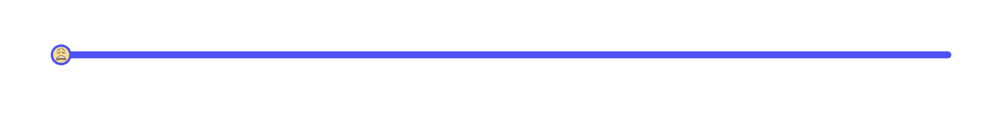
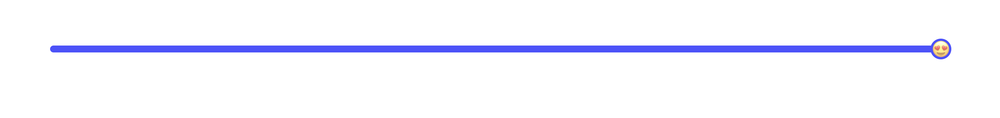

# Happy Slider





A range slider that uses smiley faces to denote changes in slider values.

### Install react-rangeslider
```
npm install react-rangeslider --save
```

## [Example](https://gmorse19.github.io/HappySlider/)
